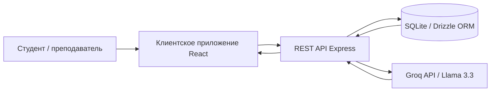
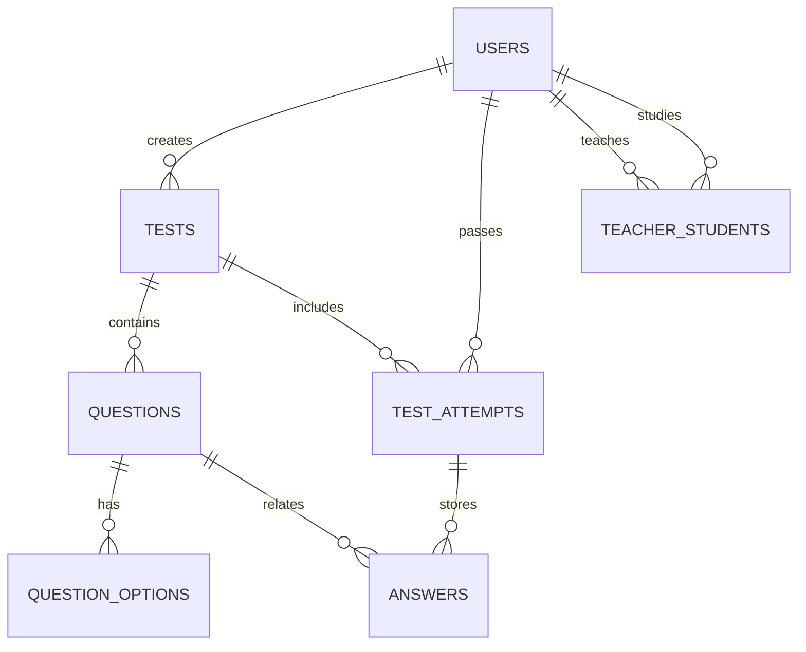
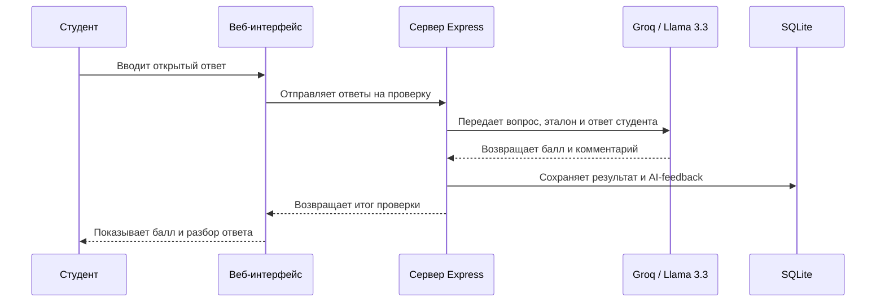

# Таблицы, схемы и графики для практической части

Ниже собраны готовые материалы, которые можно вставлять в практическую часть диплома. Они сделаны под фактическую реализацию проекта EduTest.

## Таблица 1. Основные функциональные возможности разработанной системы

| Подсистема | Реализованная функция | Практическое назначение |
| --- | --- | --- |
| Аутентификация | Регистрация, вход в систему, сессионная авторизация | Разграничение доступа между преподавателем и студентом |
| Управление тестами | Создание, редактирование, публикация тестов | Подготовка контрольных материалов преподавателем |
| Банк заданий | Поддержка вопросов с одним ответом, несколькими ответами и открытым ответом | Проверка знаний в разных формах |
| Прохождение теста | Таймер, прогресс-бар, автосохранение ответов | Повышение надежности и удобства тестирования |
| Проверка результатов | Автоматическая проверка закрытых заданий | Быстрое и объективное оценивание формализуемых ответов |
| AI-анализ | Оценка открытых ответов через API языковой модели | Получение содержательной обратной связи |
| Аналитика | Средний балл, статистика по тестам, сравнение с группой | Поддержка преподавателя и самооценки студента |
| Соревновательный режим | Рейтинг по результатам прохождения | Повышение вовлеченности обучающихся |
| Экспорт данных | Выгрузка данных в табличные и печатные форматы | Подготовка отчетности |

## Таблица 2. Состав тестовых данных, использованных для апробации прототипа

| Показатель | Значение |
| --- | ---: |
| Количество преподавателей | 3 |
| Количество студентов | 8 |
| Количество опубликованных тестов | 4 |
| Поддерживаемые типы вопросов | 3 |
| Дисциплины в модельном наборе | Информатика, математика, базы данных, компьютерные сети |
| Поддержка соревновательных тестов | Да |
| Наличие открытых вопросов для AI-анализа | Да |

## Таблица 3. Характеристика основных сущностей базы данных

| Сущность | Назначение | Ключевые поля |
| --- | --- | --- |
| users | Хранение учетных записей студентов и преподавателей | id, username, password, fullName, role |
| tests | Хранение тестов и их параметров | id, title, subject, teacherId, timeLimitMinutes, isPublished |
| questions | Хранение вопросов теста | id, testId, type, text, points, correctAnswer |
| question_options | Хранение вариантов ответа для закрытых вопросов | id, questionId, text, isCorrect |
| test_attempts | Хранение попыток прохождения тестов | id, testId, studentId, status, startedAt, completedAt, score |
| answers | Хранение ответов студента и результатов проверки | id, attemptId, questionId, answerText, selectedOptionIds, pointsAwarded, aiFeedback |
| teacher_students | Связь преподавателей и закрепленных за ними студентов | id, teacherId, studentId |

## Таблица 4. Основные сценарии тестирования разработанной системы

| № | Сценарий | Ожидаемый результат |
| ---: | --- | --- |
| 1 | Регистрация и вход пользователя | Пользователь создается, роль определяется корректно |
| 2 | Создание теста преподавателем | Тест сохраняется в базе и отображается в личном кабинете |
| 3 | Публикация теста | Тест становится доступным студентам |
| 4 | Запуск теста студентом | Создается новая попытка прохождения |
| 5 | Автосохранение ответов | Текущий прогресс не теряется при обновлении страницы |
| 6 | Завершение теста | Формируется итоговый результат и сохраняются ответы |
| 7 | Повторный запуск уже завершенного теста | Система блокирует повторное прохождение |
| 8 | Проверка открытого ответа | Сохраняется AI-оценка и текстовый комментарий |
| 9 | Просмотр результата студентом | Отображаются баллы, разбор ответов и сравнение с группой |
| 10 | Просмотр аналитики преподавателем | Отображаются сводные графики и статистика по тестам |

## Таблица 5. Преимущества выбранного технологического стека

| Технология | Назначение в проекте | Причина выбора |
| --- | --- | --- |
| React | Клиентская часть | Компонентный подход и удобная работа с интерфейсом |
| TypeScript | Типизация клиента и сервера | Снижение числа ошибок и согласованность моделей данных |
| Vite | Сборка фронтенда | Быстрый запуск и удобство разработки |
| Express | Серверное API | Простота реализации REST-маршрутов |
| SQLite | Хранение данных | Легкое локальное развертывание без отдельного сервера |
| Drizzle ORM | Работа с базой данных | Строгая типизация схемы и запросов |
| TanStack Query | Работа с запросами на клиенте | Кэширование и удобное обновление данных |
| Groq API | Доступ к языковой модели | Быстрая интеграция AI без локального развертывания модели |

## Рисунок 1. Архитектура разработанной системы

Ниже приведен Mermaid-код схемы, который можно вставить в Mermaid Live Editor или в редактор с поддержкой Mermaid и затем экспортировать как изображение.

Подпись к рисунку:
Рисунок 1 – Общая клиент-серверная архитектура системы контроля знаний студентов с интеграцией внешнего AI-сервиса.

## Рисунок 2. Логическая схема основных сущностей базы данных

Подпись к рисунку:
Рисунок 2 – Логическая модель данных разработанной системы контроля знаний.

## Рисунок 3. Последовательность AI-анализа открытого ответа

Подпись к рисунку:
Рисунок 3 – Последовательность взаимодействия компонентов при интеллектуальной проверке открытого ответа.

## Диаграмма 1. Состав модельного набора данных для апробации

Эту диаграмму можно построить как круговую по следующим данным:

| Категория | Количество |
| --- | ---: |
| Преподаватели | 3 |
| Студенты | 8 |
| Тесты | 4 |
| Типы вопросов | 3 |

Подпись к диаграмме:
Диаграмма 1 – Состав модельного набора данных, использованного для апробации прототипа.

## Диаграмма 2. Распределение основных функций системы

Эту диаграмму удобно представить как столбчатую, где по оси X расположены подсистемы, а по оси Y – условная значимость или количество реализованных операций.

| Подсистема | Условный показатель |
| --- | ---: |
| Авторизация и профили | 4 |
| Управление тестами | 6 |
| Прохождение тестов | 6 |
| AI-анализ | 3 |
| Аналитика и отчеты | 5 |

Примечание: это не количественная метрика производительности, а визуально удобный способ показать функциональную насыщенность прототипа.

Подпись к диаграмме:
Диаграмма 2 – Распределение реализованных функций по основным подсистемам разработанного прототипа.

## Таблица 6. Сравнение традиционного и интеллектуального подхода к контролю знаний

| Критерий | Традиционный контроль | Интеллектуальная система |
| --- | --- | --- |
| Скорость проверки | Зависит от преподавателя | Автоматизирована для большинства сценариев |
| Проверка открытых ответов | Трудоемкая ручная | Частично автоматизированная с AI-комментарием |
| Масштабируемость | Ограниченная | Более высокая |
| Обратная связь | Нередко краткая и отсроченная | Быстрая и более детализированная |
| Аналитика по группе | Требует ручной обработки | Формируется автоматически |
| Повторное использование данных | Ограниченное | Высокое, за счет хранения и аналитики |

## Как это лучше вставлять в диплом

1. В раздел 2.2 вставить Таблицу 3 и Рисунок 2.
2. В раздел 2.3 вставить подписи к скриншотам интерфейсов из файла приложений.
3. В раздел 2.6 вставить Рисунок 1 и Рисунок 3.
4. В раздел 2.7 вставить Таблицу 2 и Таблицу 4.
5. В раздел 2.8 или 2.9 вставить Таблицу 6 и одну из диаграмм.